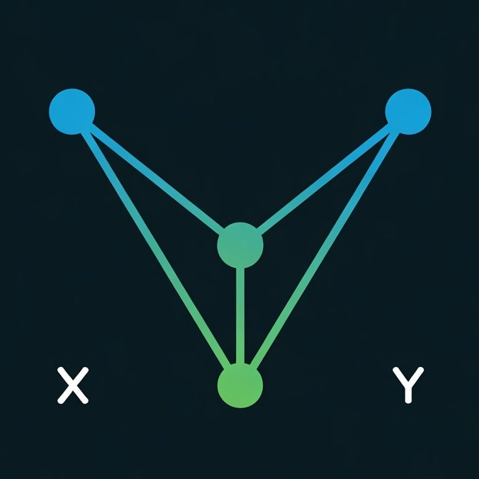

# Vizor - Free Data Visualization Tool

<div align="center">



**Turn spreadsheets into stunning visualizations in seconds**

[](https://getvizor.vercel.app)
[](LICENSE)

[Features](#features) • [Getting Started](#getting-started) • [Documentation](#documentation) • [Contributing](#contributing)

</div>

---

## 🎯 What is Vizor?

Vizor is a free, open-source data visualization tool that makes creating beautiful charts ridiculously easy. No design degree needed — just drag your data in, pick a chart, and boom — you've got something worth sharing.

**Perfect for:**
- 📊 Business analysts presenting to stakeholders
- 🎓 Students working on research projects
- 📈 Marketing teams creating reports
- 💼 Startup founders pitching to investors

---

## ✨ Features

- **20+ Chart Types** - Bar, line, pie, scatter, area, heatmap, and more
- **Real-Time Editing** - See changes instantly as you type
- **Smart Import** - Drag and drop CSV, Excel, or JSON files
- **Beautiful By Default** - Professional-looking charts out of the box
- **One-Click Export** - Download PNG, SVG, or PDF in seconds
- **Interactive Filters** - Add sliders, dropdowns, and dynamic filtering
- **Share Instantly** - Get a shareable link with one click
- **No Sign-Up Required** - Start creating immediately

---

## 🚀 Getting Started

```sh
# Step 1: Clone the repository using the project's Git URL.
git clone <YOUR_GIT_URL>

# Step 2: Navigate to the project directory.
cd <YOUR_PROJECT_NAME>

### Option 1: Use Online (Recommended)

Visit **[getvizor.vercel.app](https://getvizor.vercel.app)** and start creating immediately. No installation required!

### Option 2: Run Locally

```bash
# Clone the repository
git clone https://github.com/yourusername/vizor.git

# Navigate to project directory
cd vizor

# Install dependencies
npm install

# Start development server
npm run dev
```

Then open [http://localhost:5173](http://localhost:5173) in your browser.

---

## 🛠️ Tech Stack

- **React 18** - UI framework
- **TypeScript** - Type safety
- **Vite** - Build tool
- **Tailwind CSS** - Styling
- **Recharts** - Chart library
- **Radix UI** - Component primitives
- **Framer Motion** - Animations
- **Vercel** - Deployment

---

## 📖 Documentation

Full documentation is available at [getvizor.vercel.app/docs](https://getvizor.vercel.app/docs)

**Quick Links:**
- [Chart Types Guide](CHARTFORGE_README.md)
- [Marketing Strategy](MARKETING_PLAN.md)
- [Deployment Guide](DEPLOYMENT_CHECKLIST.md)
- [SEO Specifications](OG_IMAGE_SPEC.md)

---

## 🤝 Contributing

We welcome contributions! Here's how to get started:

1. Fork the repository
2. Create a feature branch (`git checkout -b feature/amazing-feature`)
3. Commit your changes (`git commit -m 'Add amazing feature'`)
4. Push to the branch (`git push origin feature/amazing-feature`)
5. Open a Pull Request

**Development Guidelines:**
- Follow the existing code style
- Write meaningful commit messages
- Add tests for new features
- Update documentation as needed

---

## 📄 License

This project is licensed under the MIT License - see the [LICENSE](LICENSE) file for details.

---

## 🙏 Acknowledgments

- Built with [Lovable](https://lovable.dev)
- Icons by [Lucide](https://lucide.dev)
- Charts by [Recharts](https://recharts.org)
- UI components by [Radix UI](https://radix-ui.com)

---

## 📞 Support

Need help? We're here for you:

- 📧 Email: support@vizor.app
- 🐦 Twitter: [@getvizor](https://twitter.com/getvizor)
- 💬 GitHub Issues: [Report a bug](https://github.com/yourusername/vizor/issues)

---

## 🗺️ Roadmap

- [x] 20+ chart types
- [x] Real-time editing
- [x] Export to PNG/SVG/PDF
- [x] Interactive filters
- [ ] API integration for live data
- [ ] Collaboration features
- [ ] Custom themes builder
- [ ] Mobile apps (iOS/Android)
- [ ] AI-powered chart suggestions

---

<div align="center">

**Made with ❤️ for data enthusiasts everywhere**

[Website](https://getvizor.vercel.app) • [Twitter](https://twitter.com/getvizor) • [Blog](https://getvizor.vercel.app/blog)

</div>

This project is built with:

- Vite
- TypeScript
- React
- shadcn-ui
- Tailwind CSS

## How can I deploy this project?

Simply open [Lovable](https://lovable.dev/projects/ab98c4eb-66cc-4753-b46c-f3a6c27d8ca8) and click on Share -> Publish.

## Can I connect a custom domain to my Lovable project?

Yes, you can!

To connect a domain, navigate to Project > Settings > Domains and click Connect Domain.

Read more here: [Setting up a custom domain](https://docs.lovable.dev/features/custom-domain#custom-domain)
